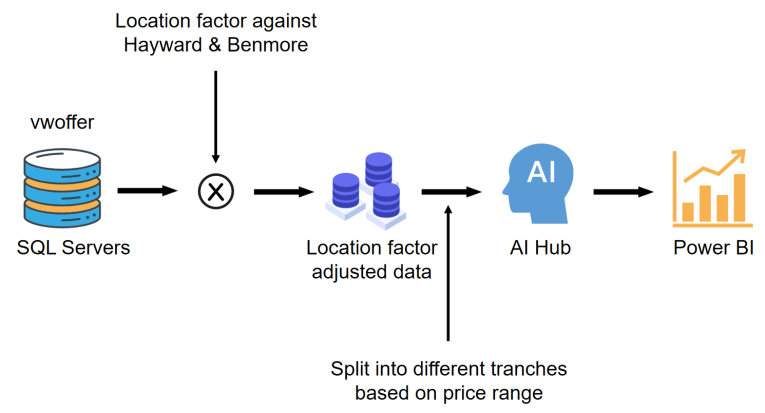
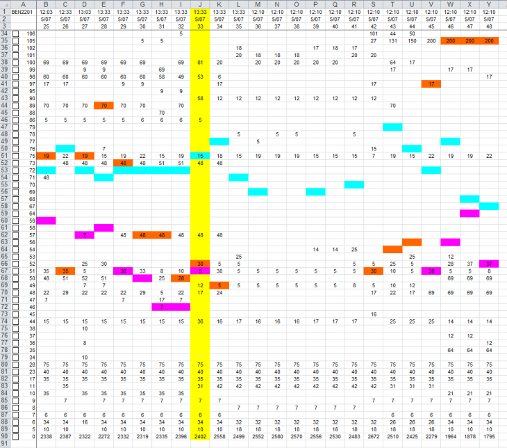
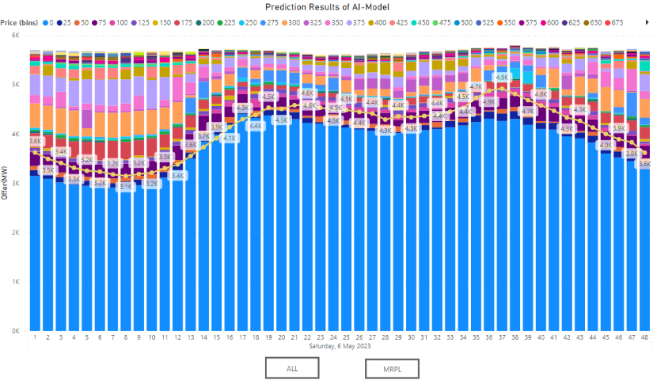
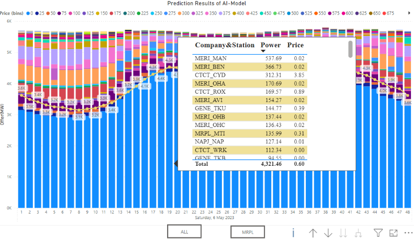

# Project Name: AI-powered Generator Identification: Unveiling Market Offers in Energy Spot Trading
🌐Github Link: https://github.com/JasonZhou2023NZ/AI-Powered-Generator-Identification

## 📌Project Overview
In New Zealand’s electricity market, participant anonymity challenges trading efficiency. I developed an AI-powered tool that unveiled hidden market offers, enhancing trading strategies and revenue.
✅Objectives:
- Decode opaque bidding behaviors in energy spot trading.
- Forecast energy offer distributions by price/quantity.
- Enable strategic offer positioning for optimal revenue.
✅Impacts:
- Effectively improved decision-making efficiency in the wholesale trading process.
- Enhanced predictive accuracy by leveraging various machine learning algorithms.

## 💡Key Features
- Data Acquisition: Collected wholesale trading market data over lastest four yesars.
- Data Preparation: Conducted features engineering; built input/output matrices.
- AI Model Creation: Trained RNN, Random Forest, LSTM, and Time-GPT models.
- Model Fine-tuning: Tuned hyperparameters for enhanced prediction.
- Data Visualization: Built Power BI dashboards for visual analytics.

## 👨‍💻Tech Stack
Python | Power BI | SQL | Excel | Pandas | Numpy | Scikit-learn | TensorFlow | Time-GPT

## 📋Results
- Time-GPT and LSTM models outperformed others.
- Improved visibility into competitor bidding behaviors.
- Enabled strategic bidding and revenue optimization.

## 🖼️Screenshots & Demo

## ⭐Future Enhancements
- Integrate outage & HVDC datasets for better accuracy.
- Apply dimensionality reduction to ease training.
- Enhance dashboards with interactive user features.